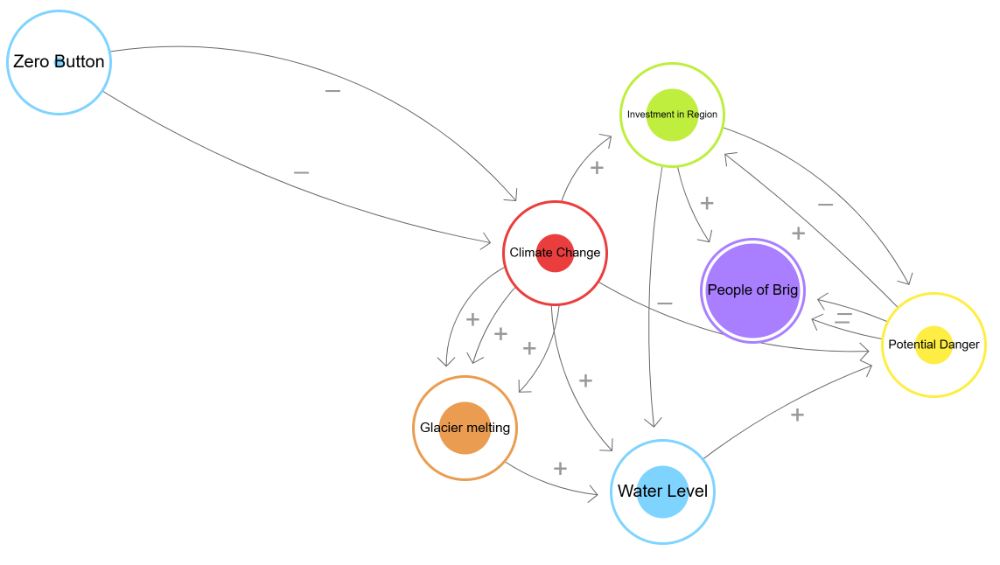
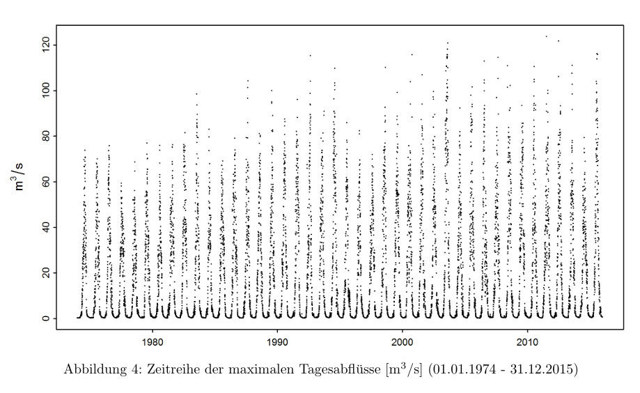

```{r setup, include=FALSE}
knitr::opts_chunk$set(echo = TRUE)
```

<u>**Loading R-Packages**</u>
```{r Loading_Packages, include=TRUE, warning=FALSE, message=FALSE, echo=TRUE, results='hide'}
#Loading needed packages
library(dplyr)
library(forecast)
library(ggplot2)
library(lubridate)
library(tidyr)
library(tseries)  # for working with time series
library(urca)     # for performing ADF unit root test
library(ismev)    # for EVT gev.fit
library(tidyverse)# for data handling (includes ggplot2, dplyr, tidyr, readr, lubridate)
library(evd)      # for calculating HQ values in EVT
library(zoo)      # for function 'yearmon'
```

# Introduction

<br><p style="font-size: 35px;"> Introduction </p><br>

The United Nations declared the year 2025 as the “International Year of Glaciers Preservation” to raise global awareness about the critical role of glaciers in the climate system and the hydrological cycle and the economic, social and environmental impacts of the impending changes [UN](https://www.un-glaciers.org/en). In alignment with this initiative, this report provides a sustainability analysis of the Aletsch Glacier, the largest glacier in the Alps. The focus lies on the Glaciers impact on the Massa river and the downstream communities in the Canton of Valais, particularly the town of Brig.
The Aletsch Glacier`s meltwater feeds the Massa River, which joins the Rhone near Brig. While increased melting can temporarily increase flood risk, the long-term loss of glacier mass threatens to reduce water availability, impacting both the local population and hydropower generation.

This report aims to analyze these risks by developing a forecasting system. This system links climate change indicators to the Aletsch Glacier's mass changes and subsequently to the waterlevel, watervolume and extreme flow events of the Massa and Rhone rivers. 

The forecasting framework is intended to support:

- Early warning systems

- Infrastructure and land-use planning

- Resilient water and energy management

The goal is to provide local communities and stakeholders with the necessary information to prepare for future challenges in flood risk and water availability.

## Research Question

How might we analyze the impact of climate change on the river levels of Massa for the Canton Valais so that the people of Brig can better prepare themselves for future changes in flood risk and water availability?

To answer this question, our analysis is divided into two components:

- Climate-Glacier-River Model: We use an ARIMAX model to link climate variables (such as temperature and precipitation) to glacier melt and resulting changes in river volume. This will allow for forecasting of typical water flow conditions and seasonal availability.

- Extreme Value Theory (EVT): EVT will be used to quantify the probability of extreme events, such as flooding, providing critical information for climate risk assessment and the development of preparedness strategies.

## Alignment with UN Sustainable Development Goals (SDGs)

This project contributes to several of the UN`s [SDGs](https://www.un.org/sustainabledevelopment/sustainable-development-goals/), particularly:

-	SDG 13: Climate Action
Modeling glacier and hydrological changes to inform climate risk reduction and resilience planning.

-	SDG 7: Affordable and Clean Energy
Evaluating hydropower reliability under changing water availability for better seasonal energy planning.

- SDG 12: Responsible Consumption and Production
Promoting efficient water resource and risk-aware infrastructure management.

- SDG 15: Life on Land 
Assessing ecosystem and habitat impacts from altered river flow regimes to support regional conservation efforts.

- SDG 6: Clean Water and Sanitation 
Providing insights into long-term water availability and its management for human and ecological needs.

## Engaging the stakeholders
Effective stakeholder collaboration is critical to ensuring actionable and locally relevant outcomes. 
We have identified three key stakeholder groups with varying levels of influence and interest.

-	Residents of Brig: 
Affected by flooding, water shortages, infrastructure resilience and overall quality of life.
-	Hydropower operators (Massa River Dam): 
Dependent on predictable inflows for energy production and meeting regulatory standards.
-	Cantonal authorities (Canton of Valais): 
Responsible for safety planning, data governance, and alignment with environmental policy and sustainability goals.

We conducted a Power–Interest Mapping to better understand the roles, motivations, and potential contributions of key stakeholders. This analysis helps guide our engagement strategies, ensuring that each group is involved in a way that reflects both their influence over outcomes and their level of interest in the project's results.

| Stakeholder | Role | Motivation | Contribution to Project | Benefits from Project |
|-------------------|------------------|---------------|-------------------------|-------------------------|
| **Residents of Brig**  | Land-use choices, emergency planning, public communication. | Flood safety, insurance costs, quality of life, tourism. | Local flood history, identification of critical sites (schools, homes), preferred warning channels. | Actionable risk information (timing, location), early-warning, guidance on adaptation measures. |
| **Massa River Dam & Hydropower Operators** | Flow regulation, reservoir level management, water release rules, maintenance. | Safety, regulatory compliance, energy yield, reputational risk. | Historical inflow/outflow data, operational rules, details of spill events. | scenarios for inflow/outflow, spill/shortage probabilities, data for decision support. |
| **Canton (Valais) Authorities** | Permits coordination, data governance, funding. | Regional safety, alignment with cantonal plans and SDGs. | Previous studies, regional hazard maps, legal standards. | Reproducible datasets, briefing materials for policymakers. |


-	Dam Operators: High Power / High Interest -> Engage closely
those managing the Massa River dam, are identified as having both high power and high interest. These operators play a critical role in water flow regulation and reservoir management, giving them significant influence over how the system responds to changing water availability. Moreover, their operational success is directly tied to reliable inflows, safety protocols, and regulatory compliance—all of which are affected by glacial melt and river dynamics. Because of this dual significance, it is essential to engage hydropower operators closely throughout the project, involving them in data sharing, scenario planning, and the development of risk management tools that align with both energy production and safety concerns.

-	Canton Authorities: High Power / Medium-High Interest -> Collaborate & align
Cantonal authorities in Valais, who oversee regional infrastructure, environmental planning, and public safety, also hold high power in terms of policy-making and resource allocation. However, their level of interest, while substantial, may be more medium-to-high, given their broader set of responsibilities across the region. These authorities are key partners for aligning our work with existing development plans and legal standards, and for ensuring that the project contributes meaningfully to regional sustainability goals. Therefore, the recommended engagement strategy with cantonal officials is one of active collaboration and strategic alignment, ensuring that their policy expertise and governance frameworks are fully integrated into the project outcomes.

-	Residents: Medium Power / High Interest -> Empower through co-design
the residents of Brig, although they may not possess the formal authority of institutions, exhibit high interest in the project due to their direct exposure to flood risk, water shortages, and changes to infrastructure resilience. Their power to influence high-level decision-making is moderate, but their lived experience, local knowledge, and community preferences are invaluable in designing practical and accepted solutions. For this reason, it is crucial to empower residents through participatory approaches, such as co-design workshops, transparent communication, and mechanisms for incorporating public feedback. Engaging them meaningfully helps build trust, improves the relevance of proposed measures, and ensures that risk communication strategies are well-targeted and effective.

## System Dynamics: Causal Loop Modelling

To understand the complex and interconnected nature between climate, glaciers, hydrology and society, we created a causal loop diagram in Loopy. It models how glacier fed river dynamics affect flood risk and community resilience in Brig.

<u>**Loopy_Model**</u>
```{r loopy_model, include = TRUE, warning=FALSE, message=FALSE, out.width="100%"}

```

[Link to Loopy Model](https://ncase.me/loopy/v1.1/?data=[[[4,977,522,0.33,%22Climate%2520Change%22,0],[5,1100,795,0.5,%22Water%2520Level%22,4],[6,1111,364,0.5,%22Investment%2520in%2520Region%22,3],[7,874,722,0.5,%22Glacier%2520melting%22,1],[8,1203,565,1,%22People%2520of%2520Brig%22,5],[9,1410,627,0.33,%22Potential%2520Danger%22,2],[10,301,246,0,%22Zero%2520Button%22,4]],[[4,7,-30,1,0],[7,5,-31,1,0],[5,9,20,1,0],[9,8,13,-1,0],[4,6,43,1,0],[4,9,-45,1,0],[4,5,-47,1,0],[6,8,-25,1,0],[9,6,-10,1,0],[4,7,43,1,0],[4,7,-66,1,0],[9,8,-13,-1,0],[6,9,57,-1,0],[10,4,-36,-1,0],[10,4,100,-1,0],[6,5,-21,-1,0]],[],10%5D)

The diagram visualizes the relationships between our key variables: Climate Change, Glacier Melting, Water Level, Potential Danger, People of Brig and Investment in Region.
Within the model, two critical types of variables are identified: stocks and flows. Stocks refer to the quantities that accumulate or deplete over time. In this context, they include the mass of the Aletsch Glacier, as well as the population exposed to flood risk in Brig.
Flows, on the other hand, represent the rates at which changes occur in these stocks. For the glacier system, the most important flows are the melt rate of the glacier, the volume of river discharge, and the amount of incoming precipitation. These influence both the water level in the river and the rate at which the glacier's mass is lost.
Driving the entire system are exogenous variables—factors that originate outside the system but have a powerful influence on it. Chief among these is climate change, represented through observable trends in temperature increases and changes in precipitation patterns. These climate drivers accelerate glacier melting, alter the seasonal distribution of water flow, and intensify the risk of extreme events such as flooding.


The key feedback loops are:

- Climate-Melt-Danger: Climate change (rising temperature) positively influences glacier melting, which in turn increases the water level. This directly leads to a higher potential danger (flooding).

- Risk-induced Migration: Increased potential danger from flooding can negatively impact the population of Brig, potentially leading to out-migration, which in turn reduces the number of people exposed to the danger.

- Adaptation: An increase in potential danger can spur investments in protective measures (e.g. flood defenses), which then reduces the potential danger.

- Diminishing Glacier Source: Glacier melting is a key positive driver for water levels, but this process also reduces the glacier's total mass (a stock variable). ultimately leading to diminished meltwater contributions and water scarcity over time.

# Datapreparation/Cleaning {#Data_preparation}

This analysis combines several complementary datasets to investigate hydrological dynamics in the Aletsch/Brig region.
For the analysis we used the following datasets:

- Glacier Mass Balance - Seasonal and annual mass balance measurements of the Grosser Aletschgletscher

- Jungfraujoch Temperature - Monthly air temperature from the high-alpone Jungfraujoch station

- Brig Rainfall - Monthly precipitation totals from Brig weather station

- Massa River - Daily hydro-meteorological observations of Massa River

- Rhone River - Daily hydro-meteorological observations of Massa River

The [feature explanation](#Table_feature_exp) can be found in the appendix.

<u>**Loading Data**</u>
```{r loading_data, include= TRUE, echo=TRUE}
# Reading in data
# for massa, rhone: why are the processed csv loaded instead of the raw data?
raw_massa <- read.csv('../data/raw/massa_CAMELS_CH_obs_based_2161.csv', header=TRUE, sep=',', na.strings='-')
raw_rhone <- read.csv('../data/raw/brig_CAMELS_CH_obs_based_2346.csv', header=TRUE, sep=',', na.strings='-')
raw_glacier <- read.csv('../data/raw/massbalance_observation.csv', header=TRUE, sep=';', na.strings='-')
raw_jungfraujoch <- read.csv("../data/raw/weather_monthly_jungfraujoch.csv", header=TRUE, sep=';', na.strings='-')
raw_brigrain <- read.csv('../data/raw/weather_rain_monthly_brig.csv', header=TRUE, sep=';', na.strings='-')
```


## Jungfraujoch Temperature
The homogeneous data series from the Jungfraujoch climate station is available on demand via [MeteoSchweiz OpenData](https://www.meteoswiss.admin.ch/services-and-publications/service/open-data.html). The station is located 3571 meters above sea level and located in the Aletsch area. We were interested in the measurement of the homogeneous monthly mean temperature covering the time span from 01/01/1933 to 01/07/2025. The temperature in Celsius was measured 2 meters above ground.

The raw Jungfraujoch weather data set was prepared by first converting the reference_timestamp column into a proper datetime format. Then the data set was reduced to the columns necessary for our analysis (station_abbr, reference_timestamp, temp_mean_C). For clarity columns were renamed. A check for missing values, confirmed that there were none. Finally a time series object of the mean temperature values was created, specifying the start and end dates as well as the monthly frequency.

<u>**data preparation for jungfraujoch**</u>
```{r jungfraujoch_temperature_data_preparation, include = TRUE}
# convert timestamp to datetime format
df_jungfraujoch <- raw_jungfraujoch %>%
  mutate(reference_timestamp = dmy_hm(reference_timestamp))
# only keep columns needed for analysis
df_jungfraujoch_reduced <- df_jungfraujoch %>% 
  select(station_abbr, reference_timestamp, ths200m0)
# rename columns
colnames(df_jungfraujoch_reduced) <- c('station_abbr', 'reference_timestamp', 'temp_mean_C')
# check for NAs
colSums(is.na(df_jungfraujoch_reduced)) # no NAs
# create time series object
# temp_mean monthly series
ts_jungfraujoch <- ts(df_jungfraujoch_reduced$temp_mean_C,
                      start = c(1933, 1),
                      end = c(1933 + (nrow(df_jungfraujoch_reduced)-1) %/% 12,
                              (nrow(df_jungfraujoch_reduced)-1) %% 12 + 1),
                      frequency = 12)

```

<u>**jungfraujoch aggreagate to annual data**</u>
```{r jungfraujoch_aggregate_annual_mean, include = TRUE}
# create a year column
df_jungfraujoch_year <- df_jungfraujoch_reduced %>%
  mutate(Year = year(reference_timestamp))

# aggregate to annual mean
df_jungfraujoch_annual <- df_jungfraujoch_year %>%
  group_by(station_abbr, Year) %>%
  summarise(temp_mean_C = mean(temp_mean_C, na.rm = TRUE), .groups = "drop")

# convert to ts object
ts_jungfraujoch_annual <- ts(df_jungfraujoch_annual$temp_mean_C,
                             start = min(df_jungfraujoch_annual$Year),
                             end = max(df_jungfraujoch_annual$Year),
                             frequency = 1)
```

## Glacier
The data is sourced from Glacier Monitoring in Switzerland (GLAMOS). Direct measurements of glacier mass balance – the sum of snow accumulation and snow/ice melt – are carried out on selected glaciers in Switzerland, based on point observations, typically acquired in April/May and September.

For clarity, unnecessary columns were removed and the others were renamed. We were interested in information specifically regarding "Grosser Aletschgletscher" hence the dataset was filtered to just the relevant rows. We converted the date columns into proper datetime format. A check for missing values, confirmed that there were none.

<u>**data preparation for glacier**</u>
```{r glacier_data_preparation, include = TRUE, echo = TRUE}
## remove unwanted columns
df_glacier <- raw_glacier %>% 
  select(-c("glacier.id", "observer", "X", "X.1", "X.2", "minimum.elevation.of.glacier", "maximum.elevation.of.glacier" ))
## rename columns to standard format
colnames(df_glacier) <- c("glacier_name", "obs_start_date", "obs_winter_end_date", "obs_end_date", "winter_mass_balance_mmwe",
                          "summer_mass_balance_mmwe", "annual_mass_balance_mmwe","equilibrium_line_altitude_m", 
                          "accumulation_area_ratio", "glacier_area_m2")
## filter out rows of unwanted glaciers
df_glacier <- df_glacier %>%
  filter(glacier_name == "Grosser Aletschgletscher")
## convert relevant columns to date type values
df_glacier <- df_glacier %>%
  mutate(across(c(obs_start_date, obs_winter_end_date, obs_end_date), 
                ~ as.Date(.x, format = "%d.%m.%Y")))
## check for NAs
colSums(is.na(df_glacier))

# create time series object for annual glacier mass balance
df_glacier_annual <- df_glacier %>%
  mutate(Year = year(obs_end_date)) %>%
  group_by(Year) %>%
  summarise(
    annual_mass_balance_mmwe = mean(annual_mass_balance_mmwe, na.rm = TRUE),
    .groups = "drop"
  ) %>%
  arrange(Year)

head(df_glacier_annual)

# create time series object
ts_glacier_annually <- ts(
  df_glacier_annual$annual_mass_balance_mmwe,
  start = min(df_jungfraujoch_annual$Year, na.rm = TRUE),
  end = max(df_glacier_annual$Year, na.rm = TRUE),
  frequency = 1
)

ts_glacier_annually
```

In order to perform correlation analysis, the bi-annual mass balance values were extrapolated to monthly values using weighted averages derived from the Jungfraujoch temperature data. 

<u>**data preparation (monhtly aggregation) for glacier**</u>
```{r glacier_monthly_data_preparation, include = TRUE, echo = TRUE}

## Function to allocate seasonal mass balance by fixed calendar seasons
allocate_mass_balance_per_year <- function(row, df_jungfraujoch_reduced){
  
  obs_year <- year(row$obs_start_date)  # Observation year for this glacier row
  # Add helper columns
  df_jungfraujoch_reduced <- df_jungfraujoch_reduced %>%
    mutate(
      year_num = year(reference_timestamp),
      month_num = month(reference_timestamp),
      year_month = format(reference_timestamp, "%Y-%m"),
      temp_mean_C = as.numeric(temp_mean_C)
    )
  
  ## Winter months: Oct–Dec from previous year, Jan–Apr from current observation year
  winter_climate <- df_jungfraujoch_reduced %>%
    filter((month_num %in% 10:12 & year_num == (obs_year - 1)) |
             (month_num %in% 1:4 & year_num == obs_year))
  
  winter_weights <- abs(winter_climate$temp_mean_C)
  if(sum(winter_weights) == 0) winter_weights <- rep(1/nrow(winter_climate), nrow(winter_climate))
  winter_weights <- winter_weights / sum(winter_weights)
  winter_alloc <- winter_weights * row$winter_mass_balance_mmwe
  
  ## Summer months: May–Sep of current observation year
  summer_climate <- df_jungfraujoch_reduced %>%
    filter(month_num %in% 5:9 & year_num == obs_year)
  
  summer_weights <- abs(summer_climate$temp_mean_C)
  if(sum(summer_weights) == 0) summer_weights <- rep(1/nrow(summer_climate), nrow(summer_climate))
  summer_weights <- summer_weights / sum(summer_weights)
  summer_alloc <- summer_weights * row$summer_mass_balance_mmwe
  
  ## Combine summer and winter calculations
  dates <- c(winter_climate$year_month, summer_climate$year_month)
  alloc <- c(winter_alloc, summer_alloc)
  
  ## Return monthly allocation
  data.frame(
    year_month = dates,
    month = c(winter_climate$month_num, summer_climate$month_num),
    mass_balance_monthly = alloc
  )
}

## Construct df_glacier_monthly
df_glacier_monthly <- bind_rows(lapply(1:nrow(df_glacier), function(i){
  allocate_mass_balance_per_year(df_glacier[i, ], df_jungfraujoch_reduced)
}))

head(df_glacier_monthly,20)
```

## Massa River
The data is freely available from the official CAMELS-CH publication [CAMELS-CH](https://essd.copernicus.org/articles/15/5755/2023/essd-15-5755-2023-assets.html) including 40 years (1981 - 2020) of daily hydro-meteorological observations.

The raw Massa dataset included daily measurements between January 1, 1981 and December 1, 2020. All column names were renamed for clarity and the date column was converted to a proper date format.

Checking for missing values revealed that the variable snow_water_equiv_mm had NAs. We decided to impute them incase we would need this variable in further analysis. The missing values were imputed with zero (0). An additional column imputed_snow_water_equiv was added as a binary flag (1 = imputed, 0 = original) to track these imputations for transparency and possible future filtering.

<u>**data preparation for river massa**</u>
```{r massa_river_data_preparation, include = TRUE}
# rename columns 
df_massa <- raw_massa %>%
  # rename(new_name = old_name)
  rename(
    date_yyyymmdd = date,
    discharge_vol_m3s = discharge_vol.m3.s.,        # m3/s
    discharge_specific_mm = discharge_spec.mm.d.,   # mm/d  
    waterlevel_m = waterlevel.m.,                   # m above sea level
    precipitation_mm = precipitation.mm.d.,         # mm/d
    temp_min = temperature_min.degC.,               # Celsius
    temp_mean = temperature_mean.degC.,             # Celsius
    temp_max = temperature_max.degC.,               # Celsius
    rel_sunshine_duration = rel_sun_dur...,         # % 
    snow_water_equiv_mm = swe.mm.                   # mm (snow water equivalent)
  ) %>%
  
  # convert date column
  mutate(
    date_yyyymmdd = as.Date(date_yyyymmdd, format = "%Y-%m-%d")
  )

# check for  Missing Values (NaN Treatment)
df_massa %>%
  summarise_all(~sum(is.na(.))) 

## only snow_water_equiv_mm has NAs
#summary(df_massa$snow_water_equiv_mm)

## find first non-missing value
#first_valid <- which(!is.na(df_massa$snow_water_equiv_mm))[1]
#df_massa$date_yyyymmdd[first_valid]

## count missing vs available
#sum(is.na(df_massa$snow_water_equiv_mm))
#sum(!is.na(df_massa$snow_water_equiv_mm))

# impute the NaN`s with 0 and add new column for imputed Yes=1, No=0 to flag them
df_massa$imputed_snow_water_equiv <- ifelse(is.na(df_massa$snow_water_equiv_mm), 1, 0)
#df_massa$imputed_snow_water_equiv
#tail(df_massa$imputed_snow_water_equiv)
#colnames(df_massa)
df_massa$snow_water_equiv_mm[is.na(df_massa$snow_water_equiv_mm)] <- 0
# check that there are no missing values left
df_massa %>%
  summarise_all(~sum(is.na(.)))
```

### Average monthly waterlevel

To be able to do analysis with complementary monthly datasets (Jungfraujoch temperature and Brig rainfall), the daily Massa river observations were aggregated to monthly resolution. Water level ("waterlevel_m"), discharge ("discharge_vol_m3s"), and temperature ("temp_mean") were calculated as monthly averages, while precipitation ("precipitation_mm") was summed to represent total monthly water input. 

The resulting monthly dataset covers the period from January 1981 to December 2020, with 480 monthly observations. As our initial analysis focuses on water level dynamics, a time series object was constructed from the monthly `waterlevel_m` values.

<u>**Creating monthly average waterlevel for massa**</u>
```{r monthly_massa_river_data_preparation, include = TRUE}
# create monthly df
df_monthly <- df_massa %>%
  mutate(
    year = year(date_yyyymmdd),
    month = month(date_yyyymmdd)
  ) %>%
  group_by(year, month) %>%
  summarise(
    date_yyyymmdd = first(date_yyyymmdd),
    waterlevel_m = mean(waterlevel_m),
    discharge_vol_m3s = mean(discharge_vol_m3s),
    precipitation_mm = sum(precipitation_mm),
    temp_mean = mean(temp_mean),
    .groups = "drop"
  )

#cat("Monthly data created:", nrow(df_monthly), "observations\n") 
#cat("Date range:", as.character(min(df_monthly$date_yyyymmdd)), "to", as.character(max(df_monthly$date_yyyymmdd)), "\n")

# create ts object for warerlevel
waterlevel_ts <- ts(df_monthly$waterlevel_m, 
                    start = c(year(min(df_monthly$date_yyyymmdd)),
                              month(min(df_monthly$date_yyyymmdd))),
                    frequency = 12)

```

### Average monthly water discharge

Since water level measurements can be less precise, as it is influenced by the shape of the riverbed, we consider as well the water discharge, expressed in cubic meters per second (m³/s). This metric provides a more accurate representation of variations in the river’s actual water volume, whereas water level indicates the height of the water surface relative to sea level.

<u>**Creating monthly average discharge for massa**</u>
```{r monthly_average_massa, include = TRUE}
# calculation average monthly watervolume
df_massa_monthly <- df_massa %>%
  mutate(Year = year(date_yyyymmdd),
         Month = month(date_yyyymmdd)) %>%
  group_by(Year, Month) %>%
  summarise(
    discharge_monthly_mean = mean(discharge_vol_m3s, na.rm = TRUE),
    .groups = "drop"
  ) %>%
  mutate(Date = as.Date(paste(Year, Month, "01", sep = "-")))


## Time Series Massa River - monthly data
ts_watervolume_monthly <- ts(df_massa_monthly$discharge_monthly_mean, 
              start = c(year(min(df_massa_monthly$Date)),
                        month(min(df_massa_monthly$Date))), 
              frequency = 12)
```

### Daily water discharge

For the EVT (Extreme Value Theory) analysis, we use daily mean water discharge values. Other reports, as referenced in the chapter EVT, also rely on this metric, which allows for a meaningful comparison of our results.

<u>**massa daily water discharge data preparation**</u>
```{r water_discharge_massa_preparation, include = TRUE}
# Read data
#df_massa <- raw_massa

## Time Series Massa River - daily data
freq_daily <- 365.2422

ts_watervolume_massa <- ts(df_massa$discharge_vol_m3s, 
              start = c(year(min(df_massa$date_yyyymmdd)),
                        yday(min(df_massa$date_yyyymmdd))), 
              frequency = freq_daily)


# creating dataframe out of ts_watervolume_massa
#----------------------------
# defining start date
massa_start_date <- as.Date("1981-01-01")
# length of time series
n <- length(ts_watervolume_massa)
# creating date
massa_dates <- seq.Date(from = massa_start_date, by = "day", length.out = n)

df_massa_prep <- data.frame(
  Date = massa_dates,
  Watervolume = ts_watervolume_massa
)

#----------------------------------------------------------------------
#----------------------------------------------------------------------
#First insights of massa data / creating ts

#plotting massa data / watervolume
#plot(ts_watervolume_massa, main = "Massa daily discharge volume in m³/s 1980 - 2020")
```

### Rhone River

A parallel data cleaning and preparation pipeline was implemented for the Rhone River dataset, which shares the same source and structure. The raw Rhone dataset included daily measurements between January 1, 1981 and December 31, 2020.

<u>**data preparation for river rhone**</u>
```{r rhone_river_data_preparation, include = TRUE}
# rename columns 
df_rhone <- raw_rhone %>%
  # rename(new_name = old_name)
  rename(
    date_yyyymmdd = date,
    discharge_vol_m3s = discharge_vol.m3.s.,        # m3/s
    discharge_specific_mm = discharge_spec.mm.d.,   # mm/d  
    waterlevel_m = waterlevel.m.,                   # m above sea level
    precipitation_mm = precipitation.mm.d.,         # mm/d
    temp_min = temperature_min.degC.,               # Celsius
    temp_mean = temperature_mean.degC.,             # Celsius
    temp_max = temperature_max.degC.,               # Celsius
    rel_sunshine_duration = rel_sun_dur...,         # % 
    snow_water_equiv_mm = swe.mm.                   # mm (snow water equivalent)
  ) %>%
  
  # convert date column
  mutate(
    date_yyyymmdd = as.Date(date_yyyymmdd, format = "%Y-%m-%d")
  )

## check data types (date_yyyymmdd as date, all others as numeric)
#str(df_rhone)

# check for  Missing Values (NaN Treatment)
df_rhone %>%
  summarise_all(~sum(is.na(.))) 

## only snow_water_equiv_mm has NAs (6453)
#summary(df_rhone$snow_water_equiv_mm)

## find first non-missing value: 1998-09-02
#first_valid <- which(!is.na(df_rhone$snow_water_equiv_mm))[1]
#df_rhone$date_yyyymmdd[first_valid]

## count missing vs available
#sum(is.na(df_rhone$snow_water_equiv_mm))
#sum(!is.na(df_rhone$snow_water_equiv_mm))

# impute the NaN`s with 0 and add new column for imputed Yes=1, No=0 to flag them
df_rhone$imputed_snow_water_equiv <- ifelse(is.na(df_rhone$snow_water_equiv_mm), 1, 0)
#df_rhone$imputed_snow_water_equiv
#tail(df_rhone$imputed_snow_water_equiv)
#colnames(df_rhone)
df_rhone$snow_water_equiv_mm[is.na(df_rhone$snow_water_equiv_mm)] <- 0

df_rhone %>%
  summarise_all(~sum(is.na(.)))
```


## Brig Rain

The Brig rain dataset provides homogeneous monthly total precipitation values in millimeters. The time series spans the period from 1961 to 2025, contains no missing values, and can therefore be directly converted into a time series object.

<u>**data preparation for brig rain**</u>
```{r brig_rain_data_preparation, include = TRUE}
raw_brigrain$Date <- as.Date(raw_brigrain$reference_timestamp, format = "%d.%m.%Y")

df_rain <- raw_brigrain %>% select(Date, rhs150m0)
#plot(df_rain)

# defining starting year and month
start_year_brig  <- year(min(df_rain$Date))
start_month_brig <- month(min(df_rain$Date))

# creating ts-object on a monthly basis
rain_ts <- ts(df_rain$rhs150m0,
              start = c(start_year_brig, start_month_brig),
              frequency = 12)   # 12 month per year
```

<u>**brig rain annual aggregation**</u>
```{r brig_rain_annual aggregation, include = TRUE}
# create year column
df_rain_annual <- df_rain %>%
  mutate(Year = year(Date)) %>%
  group_by(Year) %>%
  summarise(
    precipitation_mm = sum(rhs150m0, na.rm = TRUE), # annual total
    .groups = "drop"
  )
# create annual time series
rain_ts_annual <- ts(df_rain_annual$precipitation_mm,
                     start = min(df_rain_annual$Year),
                     frequency = 1) 
```


# Exploratory Data Analysis

To explore the impact of climate change on the Massa River and future water availability for Brig, we examined four interconnected environmental indicators: mean regional temperature, the yearly area of the Aletsch Glacier, monthly river water levels, and mean precipitation over Brig. These variables were selected because they capture both the drivers (temperature and precipitation) and the hydrological consequences (glacier retreat and river water levels) of climate change. By analyzing their long-term trends and relationships, we gain insights into how warming has already altered the glacier–river system and what this implies for Brig’s future water security.

### Temperature
```{r temperature_eda, include = TRUE}
ts_temp <- ts(df_jungfraujoch_reduced$temp_mean_C,
              start = c(1933, 1),
              frequency = 12)   # monthly data (12 obs per year)
summary(ts_temp)

# Plot observed temp with LOWESS trend
plot(ts_temp,
     ylab = "Observed Temperature (°C)",
     xlab = "Year",
     main = "Monthly Mean Temperature at Jungfraujoch",
     col = "blue", lwd = 1)

# Add smoothed trend line
lines(lowess(time(ts_temp), ts_temp), col = "red", lwd = 2)

```

A look at the summary statistics reveals that monthly mean temperatures at Jungfraujoch are predominantly below freezing, ranging from extremely cold (-21.7 C°) to just above freezing (3.5 C°). This is consistent with the high-altitude alpine climate.
The plot of monthly mean temperatures shows clear seasonal oscillations, with cold winters and milder summers. However, the long-term trend indicates a gradual rise in mean temperatures since the early 20th century. This increase aligns with broader global warming patterns and is a critical driver of glacial retreat in the Alps.

### Glacier
```{r glacier_eda, include = TRUE}
ts_mass <- ts(df_glacier$glacier_area_m2, 
              start = as.numeric(format(min(df_glacier$obs_end_date), "%Y")), 
              end = as.numeric(format(max(df_glacier$obs_end_date), "%Y")), 
              frequency = 1)
summary(ts_mass)

plot(
  ts_mass,
  ylab = "Yearly Aletsch Glacial Area (m²)",
  xlab = "Year",
  main = "Annual Area of the Aletsch Glacier",
  col = "blue",
  lwd = 1,
)
lines(lowess(ts_mass), col = "red", lwd = 3)
```

In the last 100 years, the Aletsch Glacier, the largest glacier in the Alps, has already reduced 18% in area.
The decline is especially steep in recent decades, reflecting the intensifying effects of rising temperatures. The shrinking glacier not only represents a loss of ice mass but also signals a reduced capacity to provide stable meltwater flow in the future.

### Massa Waterlevel
```{r massa_eda, include = TRUE}
summary(waterlevel_ts)

plot(
  waterlevel_ts,
  ylab = "Monthly Waterlevels of Massa (m)",
  xlab = "Year",
  main = "Monthly Average Water Level of the Massa River",
  col = "blue",
  lwd = 1,
)
lines(lowess(waterlevel_ts), col = "red", lwd = 3)
```

The Massa River exhibits distinct seasonal fluctuations, with peak water levels corresponding to summer melt periods. The long-term trend shows a slight increase in average water levels, likely due to intensified glacier melt under rising temperatures. While this suggests that warming has temporarily enhanced summer flows, such increases are not sustainable as the glacier continues to diminish. In the long run, reduced glacial mass will lead to declining water availability.

### Massa Water Discharge
```{r massa_discharge_eda, include = TRUE}
summary(ts_watervolume_monthly)

plot(
  ts_watervolume_monthly,
  ylab = "Monthly Water Discharge from Massa (m³/s)",
  xlab = "Year",
  main = "Monthly Average Water Discharge of the Massa River",
  col = "blue",
  lwd = 1,
)
lines(lowess(ts_watervolume_monthly), col = "red", lwd = 3)
```

Looking at the summary statistics, the skewed distribution (median = 3.53 m³/s, mean > median) indicates that discharge is low for much of the year, punctuated by high-flow events during the melt season.
The plot of Monthly Average Water Discharge of the Massa River shows pronounced seasonal variation in water discharge, with sharp peaks during the summer months. This pattern reflects the strong influence of glacial melt on the river’s hydrology. The long-term trend (red line) suggests a modest increase in discharge over time, consistent with intensified glacial melting.

### Brig Precipitation
```{r brig_eda, include = TRUE}
summary(rain_ts)

plot(
  rain_ts,
  ylab = "Monthly Precipation over Brig (mm)",
  xlab = "Year",
  main = "Monthly Precipitation over Brig",
  col = "blue",
  lwd = 1,
)
lines(lowess(rain_ts), col = "red", lwd = 3)
```

Precipitation data for Brig reveal considerable short-term variability but no strong long-term trend. This relative stability indicates that changes in precipitation patterns are unlikely to explain observed changes in river levels. Other factors, such as glacier melt influenced by rising temperatures, may therefore play a more significant role.

## Implications

Taken together, the exploratory findings suggest several interconnected impacts of climate change on Brig’s water resources:

  * The exploratory analysis suggests that rising temperatures accelerate glacier retreat, reducing long-term ice reserves.
  
  * In the short term, this enhances Massa River water levels, increasing the risk of high summer flows and potential flooding.
  
  * In the long term, continued glacier shrinkage could possibly weaken the buffering capacity of meltwater, threatening water security for Brig despite stable precipitation.
  
**Hypothesis**: Glacier retreat has a dual effect on downstream hydrology — initially increasing river discharge extremes due to enhanced melt, but ultimately reducing baseflow and water availability as glacier storage diminishes. This process may already be detectable in discharge anomalies observed after 2015.

These hypotheses form the basis for subsequent ARIMAX and EVT modelling, which are used to formally test the extent and significance of climate-driven impacts on Brig’s population.
  

# Stationarity

The time series were checked for stationarity by inspecting their Autocorrelation Functions (ACF) and Partial Autocorrelation Functions (PACF). To further investigate the structure of the data, we applied Seasonal-Trend decomposition using Loess (STL). STL separates the time series into trend, seasonal and remainder components, which is useful to identify and remove seasonality and trends before time series modelling. Different variations of the s.window parameter were tested to control the smoothness of the seasonal component. Additionaly the t.window parameter was used to control the smoothing of the trend component.

To formally assess the stationarity of the time series, we applied the Augmented Dickey-Fuller (ADF) test to the original series as well as to the remainder components obtained from multiple STL decompositions using varying seasonal (s.window) and trend (t.window) smoothing parameters. The ADF test consistently rejected the null hypothesis, indicating that both the raw series and the STL residuals can be considered stationary. Given the uniformly significant results, we relied primarily on visual inspection of the ACF and PACF plots of the remainder components to confirm the effective removal of seasonal and trend components and to ensure minimal autocorrelation in the residual structure.

## Temperature Jungfraujoch

### Annual mean temperature
The annual mean temperature shows a trend starting around 1980. Additionally the ACF shows a slow decay indicating non-stationarity likely due to this trend. The PACF displays a clear cut-off at lag 2, indicating an AR(2) process. The Augmented Dickey-Fuller test further indicates non-stationarity with a non-significant p-value (p = .53).

<u>**Jungfraujoch annually ACF and PACF**</u>
```{r jungfraujoch_annual_temperature_acf_pacf, include = TRUE}
plot(ts_jungfraujoch_annual)
# acf and pacf
par(mfrow = c(1,2))
acf(ts_jungfraujoch_annual)
pacf(ts_jungfraujoch_annual)
# adf
adf.test(ts_jungfraujoch_annual)
```

After differencing the ACF decays quickly. The PACF shows a mean reversion (negative partial autocorrelation) with a remaining AR process.

<u>**Jungfraujoch annually decomposition**</u>
```{r jungfraujoch_annual_temperature_decomposition, include = TRUE}
# differencing
ts_temp_diff <- diff(ts_jungfraujoch_annual)
# check adf
adf.test(ts_temp_diff)
# check ACF and PACF of differenced series
par(mfrow=c(2,1))
acf(ts_temp_diff, main="ACF: Differenced Temperature", lag.max=20)
pacf(ts_temp_diff, main="PACF: Differenced Temperature", lag.max=20)
# plot
plot(ts_temp_diff, main="Differenced Temperature")
```

### Monthly mean temperature

The ACF shows a strong seasonal pattern reflecting the annual temperature cycle. The PACF indicates that monthly mean temperatures are influenced by the previous month (lag 1). Then shows a negative connection for the next few months (lags 2 to 6) and a positive connection again (lags 8 to 13). This is likely due to temperature changes following a seasonal pattern, where each month corresponds to a specific period (e.g. season).

<u>**Jungfraujoch ACF and PACF**</u>
```{r jungfraujoch_monthly_temperature_acf_pacf, include = TRUE}
# acf and pacf
acf(ts_jungfraujoch) # acf indicates seasonality
pacf(ts_jungfraujoch) # damped sinusoid
```

We observed that larger seasonal windows slightly reduced autocorrelations in the remainder, whereas the PACF improved notably when using a large trend window. An s.window of 37 and a t.window of 121 showed the most satisfying result.
The Augmented-Dickey-Fuller test was used to formally check stationarity of the remainder. The significant result (p < .01) indicates stationarity.

<u>**Jungfraujoch Temperature STL Decomposition**</u>
```{r jungfraujoch_temperature_stl_decomposition, include = TRUE}
# decomposition with stl
ts_jungfraujoch_stl <- stl(ts_jungfraujoch, s.window = "periodic") # assumes strong, stable seasonality
plot(ts_jungfraujoch_stl, main = "s.window periodic")
ts_jungfraujoch_stl_13 <- stl(ts_jungfraujoch, s.window = 13) # 1 year smooth
plot(ts_jungfraujoch_stl_13, main = "s.window = 13")
ts_jungfraujoch_stl_25 <- stl(ts_jungfraujoch, s.window = 25) # 2 year smooth
plot(ts_jungfraujoch_stl_25, main = "s.window = 25")
ts_jungfraujoch_stl_37 <- stl(ts_jungfraujoch, s.window = 37) # 3 year smooth
plot(ts_jungfraujoch_stl_37, main = "s.window = 37")
ts_jungfraujoch_stl_37_121 <- stl(ts_jungfraujoch, s.window = 37, t.window=121) # 3 year smooth
plot(ts_jungfraujoch_stl_37_121, main = "s.window = 37, t.window=121")
ts_jungfraujoch_stl_49 <- stl(ts_jungfraujoch, s.window = 49)
plot(ts_jungfraujoch_stl_49)

remainder_periodic <- ts_jungfraujoch_stl$time.series[, "remainder"]
acf(remainder_periodic, main = "ACF of STL remainder, periodic")
pacf(remainder_periodic, main = "PACF of STL remainder, periodic")

remainder_13 <- ts_jungfraujoch_stl_13$time.series[, "remainder"]
acf(remainder_13, main = "ACF of STL remainder, s.window = 13")
pacf(remainder_13, main = "PACF of STL remainder, s.window = 13")

remainder_25 <- ts_jungfraujoch_stl_25$time.series[, "remainder"]
acf(remainder_25, main="ACF of STL remainder, s.window = 25")
pacf(remainder_25, main = "PACF of STL remainder, s.window = 25")

remainder_37 <- ts_jungfraujoch_stl_37$time.series[, "remainder"]
acf(remainder_37, main = "ACF of STL remainder, s.window = 37") # ACF lags 2 and 5 persist
pacf(remainder_37, main = "PACF of STL remainder, s.window = 37")

remainder_37_121 <- ts_jungfraujoch_stl_37_121$time.series[, "remainder"]
acf(remainder_37_121)
pacf(remainder_37_121) # no change compared to without t.window

# augmented dickey fuller test to check stationarity formally
adf.test(remainder_37_121)
```

For further modelling a data frame containing the components of the decomposed time series as well as the observed data was created and saved.

<u>**Jungfraujoch create cleaned data frame**</u>
```{r jungfraujoch_temperature_clean_df, include = TRUE}
# Extract components
components <- ts_jungfraujoch_stl_37_121$time.series
# Create a time index (Date or Year-Month depending on your ts object)
dates <- time(ts_jungfraujoch)
# Build a data frame
df_jungfraujoch_processed <- data.frame(
  date       = dates,
  observed   = as.numeric(ts_jungfraujoch),
  trend      = as.numeric(components[, "trend"]),
  seasonal   = as.numeric(components[, "seasonal"]),
  remainder  = as.numeric(components[, "remainder"])
)
# create processed data file
write.csv(df_jungfraujoch_processed, "../data/processed/jungfraujoch_temperature.csv", row.names = FALSE)
# RDS
saveRDS(df_jungfraujoch_processed, "../data/processed/jungfraujoch_temperature.rds")
```

## Glacier


## Glacier Mass Balance

### Annual glacier mass balance

Visible downward trend but ACF and PACF indicate stationarity. Since we are interested in the long-term decline of the glacier mass balance we will include the trend in the ARIMAX model.

<u>**Glacier mass balance annually ACF and PACF**</u>
```{r glacier_annual_mass_balance_acf_pacf, include = TRUE}
# plot
plot(ts_glacier_annually)
# ACF and PACF
par(mfrow=c(1,2))
acf(ts_glacier_annually)
pacf(ts_glacier_annually)
# adf
adf.test(ts_glacier_annually)
# KPSS test (null hypothesis = stationary)
kpss.test(ts_glacier_annually)

# Also check visually for trend
plot(ts_glacier_annually, main="Glacier Mass Balance Over Time")
abline(lm(ts_glacier_annually ~ time(ts_glacier_annually)), col="red")

# Check if there's a significant trend
summary(lm(ts_glacier_annually ~ time(ts_glacier_annually)))
```

### Monthly glacier mass balance

```{r glacier_differencing, include = TRUE}

ts_glacier <- ts(df_glacier_monthly$mass_balance_monthly, frequency = 12,
                 start = c(1933, 1))
ts_seasonal <- diff(ts_glacier, lag = 12)
adf_seasonal <- ur.df(ts_seasonal, type = "drift", selectlags = "AIC")
summary(adf_seasonal)
```
The original glacier series had strong trend and seasonal components and was not stationary. After seasonal differencing (lag=12) the series appears stationary: 
The ADF test on the seasonally-differenced series strongly rejects a unit root since the test statistic (τ = –22.09) is far below the 1% critical value (–3.43), confirming that the series is stationary.

### STL Decomposition

```{r glacier_stl, include = TRUE, warning=FALSE}
decomp <- stl(ts_seasonal, s.window = "periodic")
autoplot(decomp)
```

The STL decomposition of the differenced time series reveals clear evidence of non-stationarity. The trend component highlights long-term shifts (climate-driven changes), while the seasonal component shows a strong and highly regular annual cycle consistent with the natural melt–accumulation processes of glaciers. The remainder, which represents the unexplained component after removing trend and seasonality, fluctuates around zero and resembles white noise, although its variance appears to increase in recent decades, suggesting growing irregularity and more extreme events.

```{r glacier_remainders, include = TRUE}
## Extract residuals
residuals_stl <- decomp$time.series[,"remainder"]

## Plot ACF and PACF of residuals
par(mfrow=c(2,1))
acf(residuals_stl, main="ACF of STL Residuals", na.action=na.pass)
pacf(residuals_stl, main="PACF of STL Residuals", na.action=na.pass)
```

The ACF and PACF of the STL residuals provide further confirmation: both show no significant autocorrelation at any lag, indicating that the systematic seasonal and trend-driven patterns have been effectively removed and that the residual component can be treated as stationary noise.

## Rainfall Brig

### Annual Precipitation

The total annual precipiation already is stationary.

<u>**Brig rain annual**</u>
```{r brig_rain_annual, include = TRUE}
plot(rain_ts_annual)
# acf and pacf
par(mfrow = c(1,2))
acf(rain_ts_annual)
pacf(rain_ts_annual)
# adf
adf.test(rain_ts_annual)
# check for hidden non-stationarity / ARCH effects
# Square the series
rain_sq <- rain_ts_annual^2

# Plot the squared series
plot(rain_sq, type = "l", main = "Squared Annual Rainfall", ylab = "Squared values", xlab = "Year")

# ACF and PACF of squared series
par(mfrow = c(1,2))
acf(rain_sq, main = "ACF of Squared Rainfall")
pacf(rain_sq, main = "PACF of Squared Rainfall")
par(mfrow = c(1,1))
```


### Monthly - Stationarity with stl

<u>**Brig rain stl**</u>
```{r brig_rain_stl, include = TRUE}
#stl_decompose of brig rain
stl_1 <- stl(rain_ts, s.window =122, t.window=115)
plot(stl_1)
remainder_stl1 <- stl_1$time.series[,"remainder"]
adf.test(remainder_stl1)
acf(remainder_stl1, main = "ACF of residuals / Brig Rain / stl")
pacf(remainder_stl1, main = "PACF of residuals / Brig Rain / stl")
```

<u>**Brig creating dataframe with stl prepared data**</u>
```{r brig_rain_dataframe_stl, include = TRUE}
#Creating dataframe of the prepared data
rain_decomp_df <- data.frame(
  Date      = as.Date(as.yearmon(time(rain_ts))),  # month data
  Original  = as.numeric(rain_ts),                 # Raw Data
  Trend     = stl_1$time.series[,"trend"],         # Trend-Componente
  Seasonal  = stl_1$time.series[,"seasonal"],      # Saisonal-Component
  Remainder = stl_1$time.series[,"remainder"]      # Remainder
)

head(rain_decomp_df)  # for checking

#saveRDS(rain_decomp_df, file = "rain_decomposition.rds")
```


## Massa River

### Waterlevel

The time series plot reveals a strong seasonal pattern, with peak waterlevels occurring annually. The observed values range approximately between 1440 m and 1449 m above sea level, reflecting typical seasonal fluctuations driven by snowmelt and precipitation. The ACF shows significant spikes at lag 12 and its multiples, confirming strong annual seasonality. The PACF shows a high spike at lag 1, indicating a strong influence of the previous month on the current month’s water level. 
We first applied STL with a "periodic" seasonal window setting. This initial decomposition revealed a strong and stable seasonal component recurring annually, as well as a trend component (particularly visibile after the year 2000). However, the ACF and PACF of the remainder component still exhibited notable autocorrelations.

To improve the decomposition, we tested various parameter settings for both the seasonal window (s.window) and the trend window (t.window). Specifically, we compared s.window values of 13, 35, and "periodic" to adjust the smoothness of the seasonal component, while varying t.window values (e.g., 121) to control the smoothing of the trend.
The optimal decomposition was achieved using s.window = 35 and t.window = 121, which resulted in the most satisfactory balance in the ACF and PACF of the remainder component.

<u>**massa river waterlevel stationarity**</u>
```{r massa_river_waterlevel_stationarity, include=TRUE}
# create ts object for waterlevel
waterlevel_ts <- ts(df_monthly$waterlevel_m, 
                    start = c(year(min(df_monthly$date_yyyymmdd)),
                              month(min(df_monthly$date_yyyymmdd))),
                    frequency = 12)

plot(waterlevel_ts, main = "Monthly Waterlevel timeseries of Massa River", 
     ylab = "Waterlevel (m above sea level)", xlab = "Time")

par(mfrow = c(1, 2))
acf(waterlevel_ts)
pacf(waterlevel_ts)

adf.test(waterlevel_ts) #p-value 0.01 (<0.05) so according to ADF stationary

# first STL decomposition
stl_decomp <- stl(waterlevel_ts, s.window = "periodic")
plot(stl_decomp)

remainder_waterlevel <- stl_decomp$time.series[,"remainder"]
adf.test(remainder_waterlevel) # p-value 0.01
par(mfrow = c(1, 2))
acf(remainder_waterlevel, main = "ACF - STL Remainder")
pacf(remainder_waterlevel, main = "PACF - STL Remainder")

### TESTING s.window and t.window
#s.window=13, t.window=default
# stl_1 <- stl(waterlevel_ts, s.window = 13)
# plot(stl_1)
# 
# remainder_stl1 <- stl_1$time.series[,"remainder"]
# adf.test(remainder_stl1) # p-value 0.01
# acf(remainder_stl1, main = "ACF - STL Remainder")
# pacf(remainder_stl1, main = "PACF - STL Remainder")
# par(mfrow = c(1, 1))
# 
# #s.window=13, t.window=121
# stl_2 <- stl(waterlevel_ts, s.window = 13, t.window = 121)
# plot(stl_2)
# 
# remainder_stl2 <- stl_2$time.series[,"remainder"]
# adf.test(remainder_stl2) # p-value 0.01
# acf(remainder_stl2, main = "ACF - STL Remainder")
# pacf(remainder_stl2, main = "PACF - STL Remainder")
# par(mfrow = c(1, 1))
# 
# #s.window="periodic", t.window=121
# stl_3 <- stl(waterlevel_ts, s.window = "periodic", t.window = 121)
# plot(stl_3)
# 
# remainder_stl3 <- stl_3$time.series[,"remainder"]
# adf.test(remainder_stl3) # p-value 0.01
# acf(remainder_stl3, main = "ACF - STL Remainder")
# pacf(remainder_stl3, main = "PACF - STL Remainder")
# par(mfrow = c(1, 1))
# 
# #s.window="periodic", t.window=121
# stl_4 <- stl(waterlevel_ts, s.window = 35)
# plot(stl_4)
# 
# remainder_stl4 <- stl_4$time.series[,"remainder"]
# adf.test(remainder_stl4) # p-value 0.01
# acf(remainder_stl4, main = "ACF - STL Remainder")
# pacf(remainder_stl4, main = "PACF - STL Remainder")
# par(mfrow = c(1, 1))

#s.window=35, t.window=121
stl_5 <- stl(waterlevel_ts, s.window = 35, t.window=121)
plot(stl_5)

remainder_stl5 <- stl_5$time.series[,"remainder"]
adf.test(remainder_stl5) # p-value 0.01
acf(remainder_stl5, main = "ACF - STL Remainder")
pacf(remainder_stl5, main = "PACF - STL Remainder")
par(mfrow = c(1, 1))
```

For further modelling a data frame containing the decomposed time series components alongside the original observations was created and saved. This structured dataset separates deterministic components (trend + seasonal) from stochastic variations (remainder).

<u>**massa river stl_decompose**</u>
```{r stl_decomp_waterlevel, include=TRUE}
## take decomp with s.window=35, t.window=121 as final decomp and create df
stl_result <- stl(waterlevel_ts, s.window = 35, t.window=121)
trend_comp <- as.numeric(stl_result$time.series[,"trend"])
seasonal_comp <- as.numeric(stl_result$time.series[,"seasonal"])
remainder_comp <- as.numeric(stl_result$time.series[,"remainder"])

# Create the det_stoch dataframe
det_stoch <- data.frame(
  year_month = format(df_monthly$date_yyyymmdd, "%b %Y"),
  waterlevel_m = df_monthly$waterlevel_m,
  trend = trend_comp,
  seasonal = seasonal_comp,
  deterministic = trend_comp + seasonal_comp,
  stochastic = remainder_comp
)

## save det_stoch df as RDS and CSV
# saveRDS(det_stoch, "data/processed/waterlevel_det_stoch.rds")
# write.csv(det_stoch, "data/processed/waterlevel_det_stoch.csv", row.names = FALSE)
                
```


### Water Discharge

#### Monthly average discharge massa timeseries

The original, non-decomposed time series exhibits a pronounced seasonal pattern, with values ranging from 0 to 70  m³/s. This outcome is not unexpected, as the previously analyzed monthly water levels of the Massa River reveal the same phenomenon, expressed in a different metric.


<u>**plotting massa timeseries**</u>
```{r monthly_average_massa_timeseries, include = TRUE}
plot(ts_watervolume_monthly, main = "Massa mean discharge volume in m³/s 1980 - 2020")
```

#### Stationarity with stl

For the decomposition of the water discharge values, we applied as well the STL function. 

The most satisfactory results were obtained using an s.window of 24, which captures a seasonal trend with a two-year window, and a t.window of 365 to represent the long-term trend. With these settings, both the ACF and PACF display an abrupt cut at lag 1. The residuals appear random, although regular zero values remain, reflecting the winter season when no water discharge occurs. This effect could not be mitigated by the applied approach.

<u>**Stationarity with stl approach**</u>
```{r stl_monthly_massa, include = TRUE}
ts_watervolume_monthly_stl <- stl(ts_watervolume_monthly, s.window = 24, t.window=365.2422)
remainder_ts_watervolume_monthly_stl <- ts_watervolume_monthly_stl$time.series[,"remainder"]
acf(remainder_ts_watervolume_monthly_stl, main = "ACF of residuals watervolume massa / monthly average / stl")
pacf(remainder_ts_watervolume_monthly_stl, main = "PACF of residuals watervolume massa / monthly average / stl")
plot(remainder_ts_watervolume_monthly_stl, main = "Residuals watervolume massa / monthly average / stl")
adf.test(na.omit(remainder_ts_watervolume_monthly_stl))
plot(ts_watervolume_monthly_stl)
```

<u>**Creating massa stationary dataframe**</u>
```{r stl_monthly_massa_dataframe, include = TRUE}
#Creating dataframe of the prepared data
massa_monthly_mean_stl <- data.frame(
  Date      = as.Date(paste(df_massa_monthly$Year, df_massa_monthly$Month, "01", sep = "-")),  # monthly date
  Original  = as.numeric(ts_watervolume_monthly),                 # original data
  Trend     = ts_watervolume_monthly_stl$time.series[,"trend"],         # trend component
  Seasonal  = ts_watervolume_monthly_stl$time.series[,"seasonal"],      # seasonal component
  Remainder = ts_watervolume_monthly_stl$time.series[,"remainder"]      # remainder
)

head(massa_monthly_mean_stl)  # for checking

# # CSV export
# write.csv(
#   massa_monthly_mean_stl, 
#   "stationary_monthly_mean_watervolume_massa.csv", 
#   row.names = FALSE
# )
# 
# # RDS export
# saveRDS(
#   massa_monthly_mean_stl, 
#   "stationary_monthly_mean_watervolume_massa.rds"
# )
```


# Merge Data

For convenience for further modelling we merged the preprocessed datasets jungfraujoch_temperature, glacier_mass_balance, massa_waterlevel and brig_rain by the date column. Due to different start and end dates we chose to keep the overlapping time period (01/01/1981 to 01/12/2020) in order to get a complete dataset.

<u>**Merge data*</u>
```{r merge_data, include = TRUE}
# -----------------------------
# 1) Load data
# -----------------------------
df_jungfrau <- readRDS("../data/processed/jungfraujoch_temperature.rds")
df_glacier <- readRDS("../data/processed/glacier_monthly_processed.rds")
df_waterlevel <- readRDS("../data/processed/waterlevel_det_stoch.rds")
df_waterdischarge <- readRDS("../data/processed/stationary_monthly_mean_watervolume_massa.rds")
df_precipitation <- readRDS("../data/processed/rain_decomposition.rds")

# -----------------------------
# 2) Format Date columns
# -----------------------------
# Jungfrau
n <- nrow(df_jungfrau)
df_jungfrau <- df_jungfrau %>%
  mutate(Date = seq.Date(from = as.Date("1933-01-01"), by = "month", length.out = n))

# Glacier
df_glacier <- df_glacier %>%
  mutate(Date = as.Date(year_month))

# Waterlevel
month_map <- c(
  "Jan" = 1, "Feb" = 2, "Mär" = 3, "Apr" = 4,
  "Mai" = 5, "Jun" = 6, "Jul" = 7, "Aug" = 8,
  "Sep" = 9, "Okt" = 10, "Nov" = 11, "Dez" = 12
)
df_waterlevel <- df_waterlevel %>%
  mutate(
    Month = sapply(strsplit(year_month, " "), `[`, 1),
    Year = as.numeric(sapply(strsplit(year_month, " "), `[`, 2)),
    Month = month_map[Month],
    Date = as.Date(paste0(Year, "-", Month, "-01"))
  ) %>%
  select(-Month, -Year, -year_month)

# -----------------------------
# 3) Rename columns BEFORE joining
# -----------------------------
df_jungfrau <- df_jungfrau %>%
  rename(
    remainder_jungfrau = remainder,
    trend_jungfrau = trend,
    seasonal_jungfrau = seasonal,
    observed_jungfrau = observed
  )

df_glacier <- df_glacier %>%
  rename(
    remainder_glacier = stochastic,  # rename stochastic -> remainder
    trend_glacier = trend,
    seasonal_glacier = seasonal,
    deterministic_glacier = deterministic,
    mass_balance_glacier = mass_balance_monthly
  )

df_waterlevel <- df_waterlevel %>%
  rename(
    remainder_waterlevel = stochastic,  # rename stochastic -> remainder
    trend_waterlevel = trend,
    seasonal_waterlevel = seasonal,
    deterministic_waterlevel = deterministic,
    waterlevel = waterlevel_m
  )

df_waterdischarge <- df_waterdischarge %>%
  rename(
    remainder_waterdischarge = Remainder,
    trend_waterdischarge = Trend,
    seasonal_waterdischarge = Seasonal,
    waterdischarge = Original
  )

df_precipitation <- df_precipitation %>%
  rename(
    remainder_precipitation = Remainder,
    trend_precipitation = Trend,
    seasonal_precipitation = Seasonal,
    precipitation = Original
  )

# -----------------------------
# 4) Merge datasets by Date
# -----------------------------
df_merged <- df_jungfrau %>%
  full_join(df_glacier, by = "Date") %>%
  full_join(df_waterlevel, by = "Date") %>%
  full_join(df_waterdischarge, by = "Date") %>%
  full_join(df_precipitation, by = "Date") %>%
  arrange(Date)

# -----------------------------
# 5) Select overlapping date range
# -----------------------------
start_overlap <- max(
  min(df_merged$Date[!is.na(df_merged$remainder_jungfrau)]),
  min(df_merged$Date[!is.na(df_merged$remainder_glacier)]),
  min(df_merged$Date[!is.na(df_merged$remainder_waterlevel)]),
  min(df_merged$Date[!is.na(df_merged$remainder_waterdischarge)]),
  min(df_merged$Date[!is.na(df_merged$remainder_precipitation)])
)

end_overlap <- min(
  max(df_merged$Date[!is.na(df_merged$remainder_jungfrau)]),
  max(df_merged$Date[!is.na(df_merged$remainder_glacier)]),
  max(df_merged$Date[!is.na(df_merged$remainder_waterlevel)]),
  max(df_merged$Date[!is.na(df_merged$remainder_waterdischarge)]),
  max(df_merged$Date[!is.na(df_merged$remainder_precipitation)])
)

df_merged_overlap <- df_merged %>%
  filter(Date >= start_overlap & Date <= end_overlap)

# -----------------------------
# 6) Convert to multivariate ts object
# -----------------------------
df_ts <- df_merged_overlap %>%
  select(
    remainder_jungfrau,
    remainder_glacier,
    remainder_waterlevel,
    remainder_waterdischarge,
    remainder_precipitation
  )

start_year <- year(min(df_merged_overlap$Date))
start_month <- month(min(df_merged_overlap$Date))

ts_multivariate <- ts(df_ts,
                      start = c(start_year, start_month),
                      frequency = 12)

# -----------------------------
# 7) Save processed data
# -----------------------------
write.csv(df_merged_overlap, "../data/processed/df_merged.csv", row.names = FALSE)
saveRDS(df_merged_overlap, "../data/processed/df_merged.rds")
saveRDS(ts_multivariate, "../data/processed/ts_multivariate.rds")
```

# Modelling

## Climate and Glacier Melt (annual data)

First we examine the relationships between climate variables (mean temperature and total precipiation) with glaicer mass balance on a yearly level.

### Cross-Correlation Analysis (CCF)

We use CCF to identify if there are any lagged effects of climate on glacier melt. This ensures that only variables with meaningful delayed influence will be included as predictors later on. 

<u>**CCF Temperature and Glacier**</u>
```{r ccf_temperature_glacier, include = TRUE, warning=FALSE, message=FALSE}
# Find overlapping period
common_start <- max(start(ts_jungfraujoch_annual)[1], start(ts_glacier_annually)[1], start(rain_ts_annual)[1])
common_end <- min(end(ts_jungfraujoch_annual)[1], end(ts_glacier_annually)[1], end(rain_ts_annual)[1])

# Extract common periods
ts_temp_aligned <- window(ts_jungfraujoch_annual, start=common_start, end=common_end)
ts_glacier_aligned <- window(ts_glacier_annually, start=common_start, end=common_end)
ts_precip_aligned <- window(rain_ts_annual, start=common_start, end=common_end)

par(mfrow = c(1, 2))
# Temperature changes affecting glacier balance
ccf(ts_glacier_aligned, ts_temp_aligned, main="Glacier & Temperature")
ccf(ts_temp_aligned, ts_glacier_aligned, main="Temperature & Glacier")

# create lagged temperature ts (ccf -> lag 1 significant)
temp_lag1 <- stats::lag(ts_temp_aligned, -1)
cor(ts_glacier_aligned, temp_lag1)
```

The left plot shows how changes in the glacier mass-balance depend on changes in the air temperature. The CCF is significant at lag 1. This indicates that the previous year's temperature affects the current glacier mass-balance. Since the relationship is negative, higher temperatures are associated with lower glacier mass-balance. Yet the correlation (r = -0.19) is weak, meaning temperature explains only a small part of the variability in glacier mass-balance. 

<u>**CCF Precipitation and Glacier**</u>
```{r ccf_precipitation_glacier, include = TRUE, warning=FALSE, message=FALSE}
par(mfrow = c(1, 2))
# Precipitation affecting glacier balance 
ccf(ts_glacier_aligned, ts_precip_aligned, main="Glacier & Precipitation")
ccf(ts_precip_aligned, ts_glacier_aligned, main="Precipitation & Glacier")
cor(ts_glacier_aligned, ts_precip_aligned)
```

The left plot shows how changes in precipitations might affect glacier mass-balance. The CCF displays no significant lags, indicating no relationship between the two variables. The correlation (r = -0.04) is very weak as well. Since the precipitation was measured in the valley in Brig, it likely doesn't reflect the snow accumulation on the glacier due to substantial elevation differences. As glaciers respond primarily to seasonal snowfall (in winter), using total annual precipitation may not provide sufficient temporal resolution to capture this effect.

### ARIMAX

We chose to use an ARIMAX model to account for the autocorrelation in the glacier mass balance time series while incorporating temperature as an exogenous factor. This approach allows us to quantify and forecast the influence of climate variables on glacier mass changes over time. Total annual precipitation was not included, as it appeared to explain no variance in glacier mass-balance.

We applied auto.arima() to the glacier mass-balance time series, suggesting an ARIMA(0,0,3) model. An exhaustive grid search over AR, differencing, and MA orders indicated ARIMA(2,1,2) had a slightly lower AIC, but the improvement was minimal. Given the simplicity and stationary residuals of the ARIMA(0,0,3) model, we chose it for further analysis.

<u>**ARIMA Glacier Mass Balance**</u>
```{r arima_glacier_mass_balance, include = TRUE, warning=FALSE, message=FALSE}
# determine ARIMA order
fit.auto <- auto.arima(ts_glacier_aligned, stationary=TRUE, seasonal=FALSE)
summary(fit.auto)
checkresiduals(fit.auto)

best_aic <- Inf
best_order <- c(0,0,0)

for(p in 0:3){
  for(d in 0:1){
    for(q in 0:3){
      fit <- try(Arima(ts_glacier_aligned, order = c(p,d,q)), silent=TRUE)
      if(!inherits(fit, "try-error")){
        if(AIC(fit) < best_aic){
          best_aic <- AIC(fit)
          best_order <- c(p,d,q)
        }
      }
    }
  }
}
best_order
best_aic
```

<u>**ARIMAX Glacier Model**</u>
```{r arimax_glacier_model, include = TRUE, warning=FALSE, message=FALSE}
# remove first observation because of lagging
glacier_model_data <- ts_glacier_aligned[-1]
temp_lag1_data <- temp_lag1[-length(temp_lag1)]

# ARIMAX
arimax_glacier <- Arima(glacier_model_data,
                        order = c(0,0,3), 
                        xreg = temp_lag1_data)
# check model
summary(arimax_glacier)
```

<u>**ARIMAX Glacier Model Diagnostics**</u>
```{r arimax_glacier_model_diagnostics, include = TRUE, warning=FALSE, message=FALSE}
# check residuals
checkresiduals(arimax_glacier)
# ACF and PACF of residuals
par(mfrow=c(2,1))
acf(residuals(arimax_glacier))
pacf(residuals(arimax_glacier))
# Model fit statistics
AIC(arimax_glacier)
accuracy(arimax_glacier)
# Plot fitted vs actual
plot(glacier_model_data, main="Glacier Balance: Actual vs Fitted")
lines(fitted(arimax_glacier), col="red")
legend("topright", c("Actual", "Fitted"), col=c("black", "red"), lty=1)

# Forecast capability test
forecast(arimax_glacier, h=5, 
         xreg=cbind(tail(temp_lag1_data, 5))) # check interpretation
```

<u>**Forecast Glacier Model**</u>
```{r forecast_glacier_model, include = TRUE, warning=FALSE, message=FALSE}
# Forecast temperature
temp_model <- auto.arima(ts_temp_aligned)
h <- 5  # number of steps ahead to forecast
temp_forecast <- forecast(temp_model, h = h)
future_temp <- temp_forecast$mean
# Temperature forecast
plot(temp_forecast, main = "Temperature Forecast", xlab = "Time", ylab = "Temperature")

# Forecast precipitation
#precip_model <- auto.arima(ts_precip_aligned)
#precip_forecast <- forecast(precip_model, h = h)
#future_precip <- precip_forecast$mean
# Precipitation forecast
#plot(precip_forecast, main = "Precipitation Forecast", xlab = "Time", ylab = "Precipitation")

# lagged temperature for forecast: use last observed temp for first step
last_temp <- tail(ts_temp_aligned, 1)
future_temp_lag1 <- c(last_temp, future_temp[-length(future_temp)])

# combine regressors
future_xreg <- cbind(future_temp_lag1)

forecast_glacier <- forecast(arimax_glacier, h = h, xreg = future_xreg)

# Inspect forecast
print(forecast_glacier)
plot(forecast_glacier)
```

$$
\text{Glacier Balance}_t = -2380.9160 
- 270.3527 \cdot \text{Temperature}_{t-1} 
+ \varepsilon_t 
+ 0.1237\,\varepsilon_{t-1} 
- 0.0712\,\varepsilon_{t-2} 
+ 0.4184\,\varepsilon_{t-3}
$$


- 1°C warming in previous year → 271 mm w.e. additional mass loss
- Precipitation doesn't significantly affect annual balance
- Glacier has 1-year climate memory

## Climate-Glacier-River (monthly data)

We now examine how climate-driven changes in glacier mass-balance affect the water level and discharge of Massa.

### Cross-Correlation Analysis (CCF)

To investigate potential linear relationships between the different time series, we use the cross-correlation function (ccf). For this we only need the stationary remainder components of each time series, since we want to avoid spurious correlations caused by trends and seasonal components.

When looking at the output of the cross-correlation function between Jungfraujoch temperature and glacier mass balance the correlations are very weak (|r| < 0.3), indicating little to no relationship between the two variables. At a first glance this result surprised us. Yet considering that the glaicer mass balance data had been transformed to show change from year to year (by differencing with a lag of 12), this finding made sense. Glaciers react slowly and mainly to long-term seasonal and yearly patterns, not to short monthly changes. Because the two datasets were on different time scales (monthly temperature and annually glacier mass balance), it was not possible to detect a direct correlation between them. The same argumentation applies to the cross-correlation function between glacier mass balance the waterlevel of the river Massa.

<u>**CCF Jungfraujoch Temperature & Glacier Mass Balance**</u>
```{r ccf_jungfraujoch_temperature_glacier_mass_balance, include = TRUE, warning=FALSE, message=FALSE}
# Scale the two series and convert to numeric vectors
jungfrau_scaled <- as.numeric(scale(ts_multivariate[, "remainder_jungfrau"]))
glacier_scaled  <- as.numeric(scale(ts_multivariate[, "remainder_glacier"]))

# Plot scaled series
plot(jungfrau_scaled, type="l", col="orange", lwd=2,
     ylab="Scaled value", xlab="Time")
lines(glacier_scaled, col="blue", lwd=2)
legend("topright", legend=c("Temperature Jungfraujoch", "Glacier Mass Balance"),
       col=c("orange","blue"), lty=1)

# Set 1x2 layout and increase top margin
par(mfrow = c(1, 2), mar = c(4, 4, 5, 1)) # bottom, left, top, right
# CCF: Temperature leads Glacier
ccf(glacier_scaled, jungfrau_scaled, # temperature leads
    main = "CCF: Glacier vs Temperature")
# CCF: Glacier leads Temperatues
ccf(jungfrau_scaled, glacier_scaled, # glacier leads
    main = "CCF: Temperature vs Glacier")
# Reset plotting parameters
par(mfrow = c(1, 1), mar = c(5, 4, 4, 2) + 0.1)
```

<u>**CCF Glacier Mass Balance & Massa Waterlevel**</u>
```{r ccf_glacier_mass_balance_waterlevel, include = TRUE, warning=FALSE, message=FALSE}
# Scale the two series and convert to numeric vectors
waterlevel_scaled <- as.numeric(scale(ts_multivariate[, "remainder_waterlevel"]))
glacier_scaled  <- as.numeric(scale(ts_multivariate[, "remainder_glacier"]))

# Plot scaled series
plot(waterlevel_scaled, type="l", col="orange", lwd=2,
     ylab="Scaled value", xlab="Time")
lines(glacier_scaled, col="blue", lwd=2)
legend("topright", legend=c("Waterlevel Massa", "Glacier Mass Balance"),
       col=c("orange","blue"), lty=1)

# Set 1x2 layout and increase top margin
par(mfrow = c(1, 2), mar = c(4, 4, 5, 1)) # bottom, left, top, right
# CCF: Waterlevel leads Glacier
ccf(glacier_scaled, waterlevel_scaled, # waterlevel leads
    main = "CCF: Glacier vs Waterlevel")
# CCF: Glacier leads Waterlevel
ccf(waterlevel_scaled, glacier_scaled, # glacier leads
    main = "CCF: Waterlevel vs Glacier")
# Reset plotting parameters
par(mfrow = c(1, 1), mar = c(5, 4, 4, 2) + 0.1)
```

<u>**CCF Glacier Mass Balance & Massa Waterdischarge**</u>
```{r ccf_glacier_mass_balance_waterdischarge, include = TRUE, warning=FALSE, message=FALSE}
# Scale the two series and convert to numeric vectors
waterdischarge_scaled <- as.numeric(scale(ts_multivariate[, "remainder_waterdischarge"]))
glacier_scaled  <- as.numeric(scale(ts_multivariate[, "remainder_glacier"]))

# Plot scaled series
plot(waterdischarge_scaled, type="l", col="orange", lwd=2,
     ylab="Scaled value", xlab="Time")
lines(glacier_scaled, col="blue", lwd=2)
legend("topright", legend=c("Waterdischarge Massa", "Glacier Mass Balance"),
       col=c("orange","blue"), lty=1)

# Set 1x2 layout and increase top margin
par(mfrow = c(1, 2), mar = c(4, 4, 5, 1)) # bottom, left, top, right
# CCF: Waterlevel leads Glacier
ccf(glacier_scaled, waterdischarge_scaled, # waterdischarge leads
    main = "CCF: Glacier vs Waterdischarge")
# CCF: Glacier leads Waterlevel
ccf(waterdischarge_scaled, glacier_scaled, # glacier leads
    main = "CCF: Waterdischarge vs Glacier")
# Reset plotting parameters
par(mfrow = c(1, 1), mar = c(5, 4, 4, 2) + 0.1)
```

For the cross-correlation function between the Jungfraujoch temperature and the waterlevels Massa we can observe that temperature is leading with significant positive correlations at lags 0, 1 and 3. This is in line with our hypothesis that higher temperatures lead to increased snow melt, which then raises water levels with some delay. The negative correlations at lags 9 and 10 are likely due to the correlation of past high summer temperatures with low winter water levels. 

<u>**CCF Jungfraujoch Temperature & Massa Waterlevel**</u>
```{r ccf_jungfraujoch_temperature_waterlevel, include = TRUE, warning=FALSE, message=FALSE}
# Scale the two series and convert to numeric vectors
jungfrau_scaled <- as.numeric(scale(ts_multivariate[, "remainder_jungfrau"]))
waterlevel_scaled  <- as.numeric(scale(ts_multivariate[, "remainder_waterlevel"]))

# Plot scaled series
plot(jungfrau_scaled, type="l", col="orange", lwd=2,
     ylab="Scaled value", xlab="Time")
lines(waterlevel_scaled, col="blue", lwd=2)
legend("topright", legend=c("Temperature Jungfraujoch", "Waterlevel Massa"),
       col=c("orange","blue"), lty=1)

# Set 1x2 layout and increase top margin
par(mfrow = c(1, 2), mar = c(4, 4, 5, 1)) # bottom, left, top, right
# CCF: Temperature leads Waterlevel
ccf(waterlevel_scaled, jungfrau_scaled, 
    main = "CCF: Waterlevel vs Temperature")
# CCF: Glacier leads Temperatues
ccf(jungfrau_scaled, waterlevel_scaled,
    main = "CCF: Temperature vs Waterlevel")
# Reset plotting parameters
par(mfrow = c(1, 1), mar = c(5, 4, 4, 2) + 0.1)
```

When we look at waterdischarge instead of waterlevel we see a strong correlation with temperature at lag 0 (within the same month). This indicates that the monthly waterdischarge of Massa responds directly and quickly to monthly temperature changes. With the waterdischarge increasing as temperatures rise, reflecting the immediate hydrological response to snow melt and glacier melt during warmer periods. Conversly, lower temperatures are associated with lower discharge due to reduced melt and freezing.

<u>**CCF Jungfraujoch Temperature & Massa Waterdischarge**</u>
```{r ccf_jungfraujoch_temperature_waterdischarge, include = TRUE, warning=FALSE, message=FALSE}
# Scale the two series and convert to numeric vectors
jungfrau_scaled <- as.numeric(scale(ts_multivariate[, "remainder_jungfrau"]))
waterdischarge_scaled  <- as.numeric(scale(ts_multivariate[, "remainder_waterdischarge"]))

# Plot scaled series
plot(jungfrau_scaled, type="l", col="orange", lwd=2,
     ylab="Scaled value", xlab="Time")
lines(waterdischarge_scaled, col="blue", lwd=2)
legend("topright", legend=c("Temperature Jungfraujoch", "Waterdischarge Massa"),
       col=c("orange","blue"), lty=1)

# Set 1x2 layout and increase top margin
par(mfrow = c(1, 2), mar = c(4, 4, 5, 1)) # bottom, left, top, right
# CCF: Temperature leads Waterdischarge
ccf(waterdischarge_scaled, jungfrau_scaled, 
    main = "CCF: Waterdischarge vs Temperature")
# CCF: Glacier leads Temperatues
ccf(jungfrau_scaled, waterdischarge_scaled,
    main = "CCF: Temperature vs Waterdischarge")
# Reset plotting parameters
par(mfrow = c(1, 1), mar = c(5, 4, 4, 2) + 0.1)
```

The cross-correlation analysis between the monthly precipitations in Brig and the monthly waterlevels of Massa shows no significant relationship. Due to the use of monthly data it is possible that short-term effects were smoothed out. It might also be the case that precipitations in the valley in Brig does not reflect the hdydrological processes in the glacial upstream cachement of the river Massa. In further analysis snow and glacier melt should be taken into account as well. In addition, using the water discharge instead of water level could provide a more direct measure of the river's hydrological response.

<u>**CCF Precipitation Brig & Massa Waterlevel**</u>
```{r ccf_precipitation_waterlevel, include = TRUE, warning=FALSE, message=FALSE}
# Scale the two series and convert to numeric vectors
precipitation_scaled <- as.numeric(scale(ts_multivariate[, "remainder_precipitation"]))
waterlevel_scaled  <- as.numeric(scale(ts_multivariate[, "remainder_waterlevel"]))

# Plot scaled series
plot(precipitation_scaled, type="l", col="orange", lwd=2,
     ylab="Scaled value", xlab="Time")
lines(waterlevel_scaled, col="blue", lwd=2)
legend("topright", legend=c("Precipitation Brig", "Waterlevel Massa"),
       col=c("orange","blue"), lty=1)

# Set 1x2 layout and increase top margin
par(mfrow = c(1, 2), mar = c(4, 4, 5, 1)) # bottom, left, top, right
# CCF: Precipitation leads Waterlevel
ccf(waterlevel_scaled, precipitation_scaled, 
    main = "CCF: Waterlevel vs Precipitation")
# CCF: Waterlevel leads Precipitation
ccf(precipitation_scaled, waterlevel_scaled,
    main = "CCF: Precipitation vs Waterlevel")
# Reset plotting parameters
par(mfrow = c(1, 1), mar = c(5, 4, 4, 2) + 0.1)
```

<u>**CCF Precipitation Brig & Massa Waterdischarge**</u>
```{r ccf_precipitation_waterdischarge, include = TRUE, warning=FALSE, message=FALSE}
# Scale the two series and convert to numeric vectors
precipitation_scaled <- as.numeric(scale(ts_multivariate[, "remainder_precipitation"]))
waterdischarge_scaled  <- as.numeric(scale(ts_multivariate[, "remainder_waterdischarge"]))

# Plot scaled series
plot(precipitation_scaled, type="l", col="orange", lwd=2,
     ylab="Scaled value", xlab="Time")
lines(waterdischarge_scaled, col="blue", lwd=2)
legend("topright", legend=c("Precipitation Brig", "Waterdischarge Massa"),
       col=c("orange","blue"), lty=1)

# Set 1x2 layout and increase top margin
par(mfrow = c(1, 2), mar = c(4, 4, 5, 1)) # bottom, left, top, right
# CCF: Precipitation leads Waterdischarge
ccf(waterdischarge_scaled, precipitation_scaled, 
    main = "CCF: Waterdischarge vs Precipitation")
# CCF: Waterdischarge leads Precipitation
ccf(precipitation_scaled, waterdischarge_scaled,
    main = "CCF: Precipitation vs Waterdischarge")
# Reset plotting parameters
par(mfrow = c(1, 1), mar = c(5, 4, 4, 2) + 0.1)
```

## Extreme Value Theory (EVT) {#EVT_Massa_Report}

For the EVT analysis, we focus primarily on the Massa River, while the identical data preparation and visualization steps for the Rhone River are provided in the [appendix](#EVT_Rhone_Appendix). As the Rhone is not the core subject of this project, its results are not discussed in detail in the main body of the report.

### River Massa

In this section, we take a closer look at the water discharge of the Massa River, measured in cubic meters per second (m³/s), as it provides a reliable indication of the river’s flow volume.

In addition, there exists a report by the BAG [Hochwasserstatistik - Stationsbericht: Massa - Blatten bei Naters](https://www.hydrodaten.admin.ch/documents/Hochwasserstatistikberichte/2161_hq_Bericht.pdf) addressing the same subject. While their dataset spans the years 1925–2015, our analysis is based on data from 1980–2020.

By comparing the plots, it becomes apparent that the BAG dataset contains many observations exceeding 100 m³/s, whereas our dataset does not surpass this threshold, despite overlapping observation periods. A key difference is that the BAG report is based on daily maximum values, whereas our analysis uses daily mean values.

<u>**Daily maximum water discharge plot of river Massa (Screenshot out of BAG report)**</u>
```{r EVT_bag_report_massa, include = TRUE, warning=FALSE, message=FALSE, out.width="100%"}

```

<u>**Daily mean water discharge plot of river Massa**</u>
```{r EVT_daily_mean_massa, include = TRUE, warning=FALSE, message=FALSE, out.width="100%"}
ggplot(df_massa_prep, aes(x=df_massa_prep$Date, y=df_massa_prep$Watervolume)) +
  geom_point(size = 0.5) +
  labs(
    title = "Water mean discharge of river Massa",
    x = "Date",
    y = "Water Discharge (m³/s)"
  ) +
  theme_minimal()

```

When cross-checking our data with the [Massa – Blatten bei Naters](https://www.hydrodaten.admin.ch/en/seen-und-fluesse/stations/2161#waterlevel-annual) records, which also provide daily mean values, we find identical results, confirming the accuracy and reliability of our dataset.

Due to the differences in data sources and measurement approaches, it is likely that our EVT results will differ from those presented in the BAG report. Nevertheless, the BAG report remains a valuable reference, allowing us to assess whether our findings exhibit similar patterns.

#### Histogram of water discharge of river Massa

The histogram exhibits a pronounced right-skewed distribution, which at first glance might seem counterintuitive. This can be attributed to the hydrological regime of the Massa River, which is almost exclusively sustained by glacial meltwater and precipitation within the valley. During the winter season, precipitation is minimal and the glacier contributes no meltwater, leading to extended periods of zero discharge. As a result, the histogram displays a high frequency of zero values. In contrast, the extreme discharge events, which occur only very occasionally during the observation period of 1980-2020, reach values of nearly 100 m³/s.

<u>**EVT Massa Histogram**</u>
```{r EVT_histogram_massa, include = TRUE, warning=FALSE, message=FALSE, out.width="100%"}
# histogram
p_massa <- ggplot(df_massa_prep, aes(x=Watervolume)) + 
  geom_histogram() +
  ggtitle("Histogramm of massa water discharge in m³/s") +
  theme_minimal()
plot(p_massa)
```

#### Plotting lm-trend line

By plotting the trend line of the Massa River discharge over the observed period, we can observe a positive trend. When constructing a trend line based only on the upper 95 quantile values, we obtain a very similar trend, differing only in its offset/intercept.

This indicates that the extreme values follow the same long-term trend as the overall data. For Extreme Value Theory (EVT) analysis, this is important because it suggests that the data can be treated as approximately stationary once the trend is accounted for. If the trends differed significantly, it would be necessary to remove the trend from the extreme values before applying EVT to ensure valid modeling of the extremes.

<u>**EVT Massa Data Preparation**</u>
```{r EVT_massa, include = TRUE, warning=FALSE, message=FALSE, out.width="100%"}
# defining trend lm
massa_t_lm <- lm(Watervolume ~ Date, data = df_massa_prep)

# defining trend lm with extrem values
threshold <- quantile(df_massa_prep$Watervolume, 0.95)  # upper 5%-quantile
massa_ex <- subset(df_massa_prep, Watervolume > threshold)

massa_ex_t_lm <- lm(Watervolume ~ Date, data = massa_ex)

# storing lm coef in dataframe
trend_df <- data.frame(
  intercept = c(coef(massa_t_lm)[1], coef(massa_ex_t_lm)[1]),
  slope     = c(coef(massa_t_lm)[2], coef(massa_ex_t_lm)[2]),
  type      = c("Trend with all values", "Trend with extreme values")
)

# Plotting raw data with trend lines
ggplot(df_massa_prep, aes(x = Date, y = Watervolume)) +
  geom_line(color = "black") +
  geom_abline(data = trend_df,
              aes(intercept = intercept, slope = slope, color = type),
              size = 1) +
  labs(title = "Water discharge with trend lines",
       x = "Year", y = expression("m"^3*"/s"),
       color = "Trend type") +
  theme_minimal()
```

#### EVT Peaks over Threshold (POT)

By setting the threshold at the upper 0.998 quantile, we obtain 30 observations that align well on the quantile plot, indicating an approximately normal distribution.

The return level plot illustrates and predicts the frequency of extreme events. It also shows that the observed values follow the fitted trend line closely. Since the POT method was applied, the return period is expressed on a daily logistic basis.

The return level plot further suggests that approximately every 1,000 days an extreme event of around 100 m³/s may occur. The curve exhibits a logarithmic-like shape, gradually flattening at a level close to 100 m³/s.


<u>**EVT POT massa**</u>
```{r EVT_modeling_threshold_massa, include = TRUE}
#EVT original data on upper quantil
threshold_massa_evt <- quantile(df_massa_prep$Watervolume, 0.998)
#Amount of observation points
sum(df_massa_prep$Watervolume > threshold_massa_evt)
massa_ex <- df_massa_prep %>% filter(df_massa_prep$Watervolume > threshold_massa_evt)
massa_ex_fit <- gev.fit(massa_ex$Watervolume)
gev.diag(massa_ex_fit) # -> Return Period is on a daily scale
massa_ex_fit$mle
```

#### EVT Block Max Year

With the Block Maxima (yearly) method, we consider the maximum water discharge value of each year. When plotted, the resulting quantile plot shows that the observations align closely with the reference line.

The return level plot illustrates and predicts the frequency of extreme events on a yearly scale. Its shape closely resembles that of the POT approach. After approximately 10 years, the curve approaches a value of around 95 m³/s and levels off into a plateau at approximately 100 m³/s, without exceeding it. This suggests that even over a 1,000-year return period, the discharge is unlikely to surpass 100 m³/s.

<u>**EVT Block max year massa**</u>
```{r EVT_modeling_block_max_massa, include = TRUE}
#-----------------
#EVT original data block max year

df_massa_prep <- df_massa_prep %>%
  mutate(Date = massa_start_date + (Date - min(Date)))  # Time as day offset

massa_max_year <- df_massa_prep %>%
  mutate(YEAR = year(Date),
         MONTH = month(Date)) %>%
  group_by(YEAR) %>%
  summarize(Watervolume_MAX = max(Watervolume, na.rm = TRUE)) %>%
  ungroup()

massa_max_year_fit <- gev.fit(massa_max_year$Watervolume_MAX)
gev.diag(massa_max_year_fit) # -> Return Period is on a yearly scale
massa_max_year_fit$mle
```

#### EVT HQ Values

The ‘EVT HQ Block Max Massa’ table provides a clear and easily interpretable overview of the extreme values. It lists the return periods in years and the corresponding HQ values (High-Flood Discharge, Hochwasserkennwert) in m³/s. It corresponds to the Return Level Plot of the Block Max approach.

<u>**EVT HQ block max Massa**</u>
```{r EVT_modeling_hq_massa, include = TRUE}
# Outputting HQ Values
# -> -> Hochwasser-Quantil / Hochwasserabluss: flood quantil for a defined return interval
# -> HQ2 means the watervolume will be achieved/exceeded each 2 years

loc_massa <- massa_max_year_fit$mle[1]
scale_massa <- massa_max_year_fit$mle[2]
shape_massa <- massa_max_year_fit$mle[3]

# return periode in years
return_periods_massa <- c(2, 10, 30, 100, 300)

# probability p = 1 - 1/T
p <- 1 - 1 / return_periods_massa


# calculating HQ-Value
HQ_massa <- qgev(p, loc=loc_massa, scale=scale_massa, shape=shape_massa)

# output
hq_table_massa <- data.frame(ReturnPeriod = return_periods_massa, HQ = HQ_massa)
hq_table_massa
```

#### EVT conclusion

Our EVT analysis for the Massa River does not predict any extreme events approaching the “Bemessungshochwasser” of the Gibidum Dam. This indicates that the dam was appropriately dimensioned at the time of its construction and is capable of withstanding future extreme water discharges.

However, as expected, our results differ from the BAG report, which predicts events of up to 150 m³/s (depending on the EVT method used) occurring approximately every 300 years. This difference is primarily due to the BAG analysis being based on daily maximum values, whereas our study uses daily mean values. Consequently, their approach is better suited for capturing the absolute extreme events. Nevertheless, even their estimated extremes remain well below the 450 m³/s design discharge that the Gibidum Dam was engineered to withstand.

What is not addressed in our EVT analysis, however, is the impact of the glacier’s retreat and its associated counterpressure on the valley and surrounding rocks. This may destabilize the ground and trigger landslides, potentially affecting the structural integrity of the dam directly, or indirectly through debris avalanches. Events such as the glacier/rock collapse in Blatten in spring 2025 illustrate how these processes can lead to unpredictable natural disasters.

# Conclusion

This report examined how climate change is reshaping the Aletsch Glacier and the Massa River that supports the town of Brig. By combining historical climate data, statistical forecasting, and extreme value theory, the analysis provides insights into future water availability and flood risk. 

The results show that temperature is the main driver of glacier loss. Glacier mass balance reacts to the previous year’s temperature, meaning it has a one-year “climate memory.” The ARIMAX model quantifies this effect: each 1 °C rise in annual temperature leads to about 270 mm of extra glacier mass loss. Precipitation, as measured in the valley, has little influence. On a monthly scale, higher temperatures directly increase river discharge, showing the Massa reacts quickly to seasonal melt. 

Extreme Value Theory indicates that, despite higher short-term flows, extreme discharges remain below the design limits of the Gibidum Dam. This means major flood risks are unlikely for Brig in the near future. The long-term retreat of the glacier, however, will reduce water storage and may destabilize surrounding slopes, increasing the risk of landslides or debris flows. For Brig and the Canton of Valais, this creates a dual challenge: managing higher seasonal flows now while preparing for eventual water scarcity as the glacier continues to shrink. 

The forecasting framework developed in this report offers guidance for early-warning systems, hydropower planning, and adaptive land-use strategies. These findings strengthen the relevance of the UN Sustainable Development Goals by linking local glacier change to global climate action, clean energy, and sustainable water management. Climate adaptation is no longer a vague future goal but an urgent planning priority, requiring continued data collection, open stakeholder dialogue, and regular updates to forecasts to protect both people and alpine ecosystems.

# Outlook

In this section, we look ahead to the future and describe next steps that can be taken to take this research further. 

  * The current analysis would be greatly enhanced by data from the Massa hydro power project. This would help us identify how much artificial regulation of the Massa water levels is performed by the dam. Using this, we can extrapolate the true effect of the melting ice from the glacier on the river.
  
  * The project would benefit by extending the analysis to include other contributing factors such as solar radiation, greenhouse gas emissions and local topography such as slope and ascent. All these factors directly affect glacier melt rate thereby adding to rising water levels in the rivers.
  
  * Considering a long-term plan, including research from other climate studies would be crucial in improving model accuracy by provide more context on global warming trends, comparative data and analyzing general patterns of how glacier melts affect rivers. 
  
  * For a future course of action, the analysis can be extended to other glaciers in Switzerland, and even further to the Alps as a whole. Owing to the large size and surface area of Aletsch glacier, it is more resilient to changing environmental conditions. Hence, studying other glaciers might show evidence of more pressing concerns.


# Disclaimer for AI

In the preparation of this report, artificial intelligence (AI) tools were employed to support specific tasks. The following points outline the scope and manner of AI usage:

- reformulation of text passages
- support in R coding for data preparation, visualization and modeling

The responsibility for the selection, verification, and interpretation of all information and results lies entirely with the authors.

# Appendix

## Feature Explanation of the dataset {#Table_feature_exp}

[Back to Chapter 'Datapreparation/Cleaning'](#Data_preparation)

### Glacier Data

Winter/Summer/Annual mass balance (Bw/Bs/Ba) → millimeters water equivalent (mm w.e.), representing the amount of snow accumulated in winter/summer/annually converted to the equivalent depth of water. 
The Equilibrium Line Altitude (ELA) -> the elevation on a glacier where annual accumulation equals annual ablation. (If temperatures rise or snowfall decreases, the ELA rises.)
Minimum and maximum elevation of glacier → Determines vertical gradient and exposure to temperature changes.
Accumulation Area Ratio -> Area of Accumulation Zone / Total Glacier Area. It is used as a climate/glacier health indicator. If the AAR is lower (e.g. 0.2), it means the glacier is losing mass and shrinking.

### Massa and River Rhone

- waterlevel_m: observed daily water head above sea level in meters
- discharge_vol_m3s: observed catchment discharge m3/s
- discharge_specific_mm: observed catchment-specific discharge (converted to millimetres per day using catchment areas)
- precipitation_mm: observed daily summed precipitation in mm/d
- temp_min: observed daily minimum temperature in Celsius
- temp_mean: observed daily averaged temperature in Celsius
- temp_max: observed daily maximum temperature in Celsius
- rel_sunshine-duration: observed daily averaged relative sunshine (solar irradiance ≥ 200 W m−2) duration in %
- snow_water_equiv_mm: observed daily averaged snow water equivalent in mm (=it is the height of water that would result if you melted the snow down to its liquid state)
Meaning of catchment = a land area, bounded by natural high points like hills or mountains, where all water, including rainfall and snowmelt, collects and drains into a single common outlet, such as a river, lake, or the ocean.

## EVT river Rhone {#EVT_Rhone_Appendix}

[Back to Chapter 'Extreme Value Theory (EVT)'](#EVT_Massa_Report)

### First data analysis rhone

<u>**EVT Rhone Data Preparation**</u>
```{r evt_rhone_preparation, echo=FALSE}
# Read data
#df_rhone <- raw_rhone

## Time Series Rhone River - daily data
freq_daily <- 365.2422

ts_watervolume_rhone <- ts(df_rhone$discharge_vol_m3s, 
              start = c(year(min(df_rhone$date_yyyymmdd)),
                        yday(min(df_rhone$date_yyyymmdd))), 
              frequency = freq_daily)


# creating dataframe out of ts_watervolume_rhone 
#----------------------------
# defining start date
rhone_start_date <- as.Date("1981-01-01")
# length of time series
n <- length(ts_watervolume_rhone)
# creating date
rhone_dates <- seq.Date(from = rhone_start_date, by = "day", length.out = n)

df_rhone_prep <- data.frame(
  Date = rhone_dates,
  Watervolume = ts_watervolume_rhone
)

#----------------------------------------------------------------------
#----------------------------------------------------------------------
#First insights of rhone data / creating ts

#plotting rhone data / watervolume
plot(ts_watervolume_rhone, main = "Rhone daily discharge volume in m³/s 1980 - 2020")
```

<u>**EVT Rhone Histogram**</u>
```{r EVT_histogram_rhone, include = TRUE, warning=FALSE, message=FALSE}
# histogram
p_rhone <- ggplot(df_rhone_prep, aes(x=Watervolume)) + 
  geom_histogram() +
  ggtitle("Histogramm of rhone water discharge in m³/s")
plot(p_rhone)
```

### Plotting lm-trend line

<u>**EVT Rhone Data Preparation**</u>
```{r EVT_rhone, include = TRUE, warning=FALSE, message=FALSE}
# defining trend lm
rhone_t_lm <- lm(Watervolume ~ Date, data = df_rhone_prep)

# defining trend lm with extrem values
threshold <- quantile(df_rhone_prep$Watervolume, 0.95)  # upper 5%-quantile
rhone_ex <- subset(df_rhone_prep, Watervolume > threshold)

rhone_ex_t_lm <- lm(Watervolume ~ Date, data = rhone_ex)

# storing lm coef in dataframe
trend_df <- data.frame(
  intercept = c(coef(rhone_t_lm)[1], coef(rhone_ex_t_lm)[1]),
  slope     = c(coef(rhone_t_lm)[2], coef(rhone_ex_t_lm)[2]),
  type      = c("Trend with all values", "Trend with extreme values")
)

# Plotting raw data with trend lines
ggplot(df_rhone_prep, aes(x = Date, y = Watervolume)) +
  geom_line(color = "black") +
  geom_abline(data = trend_df,
              aes(intercept = intercept, slope = slope, color = type),
              size = 1) +
  labs(title = "Water discharge with trend lines",
       x = "Year", y = expression("m"^3*"/s"),
       color = "Trend type") +
  theme_minimal()
```


### EVT Peaks over Threshold (POT)

<u>**EVT POT Rhone**</u>
```{r EVT_modeling_threshold_rhone, include = TRUE}
#EVT original data on upper quantil
threshold_rhone_evt <- quantile(df_rhone_prep$Watervolume, 0.998)
rhone_ex <- df_rhone_prep %>% filter(df_rhone_prep$Watervolume > threshold_rhone_evt)
rhone_ex_fit <- gev.fit(rhone_ex$Watervolume)
gev.diag(rhone_ex_fit) # -> Return Period is on a daily scale
rhone_ex_fit$mle
```

### EVT Block Max Year 

<u>**EVT Block max year Rhone**</u>
```{r EVT_modeling_block_max_rhone, include = TRUE}
#-----------------
#EVT original data block max year

df_rhone_prep <- df_rhone_prep %>%
  mutate(Date = rhone_start_date + (Date - min(Date)))  # Time as day offset

rhone_max_year <- df_rhone_prep %>%
  mutate(YEAR = year(Date),
         MONTH = month(Date)) %>%
  group_by(YEAR) %>%
  summarize(Watervolume_MAX = max(Watervolume, na.rm = TRUE)) %>%
  ungroup()

rhone_max_year_fit <- gev.fit(rhone_max_year$Watervolume_MAX)
gev.diag(rhone_max_year_fit) # -> Return Period is on a yearly scale
rhone_max_year_fit$mle
```

### EVT HQ Values

<u>**EVT HQ block max Rhone**</u>
```{r EVT_modeling_hq_rhone, include = TRUE}
# Outputting HQ Values
# -> -> Hochwasser-Quantil / Hochwasserabluss: flood quantil for a defined return interval
# -> HQ2 means the watervolume will be achieved/exceeded each 2 years

loc_rhone <- rhone_max_year_fit$mle[1]
scale_rhone <- rhone_max_year_fit$mle[2]
shape_rhone <- rhone_max_year_fit$mle[3]

# return periode in years
return_periods_rhone <- c(2, 10, 30, 100, 300)

# probability p = 1 - 1/T
p <- 1 - 1 / return_periods_rhone


# calculating HQ-Value
HQ_rhone <- qgev(p, loc=loc_rhone, scale=scale_rhone, shape=shape_rhone)

# output
hq_table_rhone <- data.frame(ReturnPeriod = return_periods_rhone, HQ = HQ_rhone)
hq_table_rhone
```

